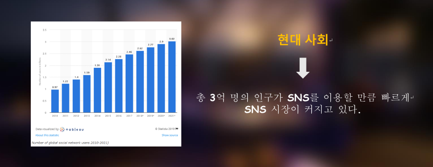

# Face Mozaic

## [Dataset]

마스크 낀 사람과 안 낀 사람 모두 detection 해야 하기 때문에 모든 종류의 dataset 이 필요

- [https://www.kaggle.com/andrewmvd/face-mask-detection](https://www.kaggle.com/andrewmvd/face-mask-detection)

## [기능 구성]

다음 그림과 총 4개의 기능을 가지고 있다. 

---

## [개발 스택]

### ⇒ 파일 첨부

[FaceMosaic/_.pdf](FaceMosaic/_.pdf)